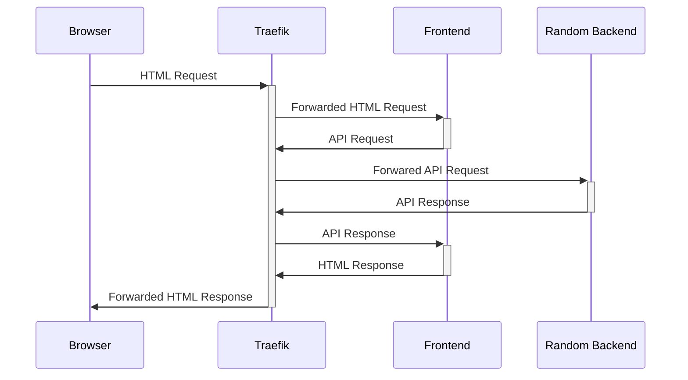

# Polyglot Website

Polyglot Website for the
[Polyglot Conference](https://blog.carolina.codes/p/a-polyglot-site-for-a-polyglot-conference).
Full participation details in the blog post.

# Running Locally

1. `cp .env.sample .env`
2. Fill in `.env` with your own values
3. `docker compose up`

# Architecture



# Developing a Backend

The backend can really be anything you want as long as it means the following
requiements:

* Is packaged as a Docker container.
* Provides one exposed port that service HTTP traffic (if you really have to
  expose more than one port we can do that we just need a different config).
* Provides the JSON API per the API documentation (coming soon).
* All responses have the header `X-Backend` with the name of your backend
  (If someone knows how to get Traefik to do this automatically submit a PR).

Generally your steps will be:

1. Create a `backends/my_backend` directory.
2. Add your app to that directory.
3. Add a `Dockerfile` that packages your app as a container.
4. Add your backend as a service in the `docker-compose.yml` file (just copy
   and paste from one of the others and update as needed).

Verify your contain is working by running:

```
docker compose my_backend frontend
```

This will start just your backend, the frontend and all the other dependent
services. Now visit http://127.0.0.1 and you should see the website being
served exclusively by your backend.

If you hit `<ctrl-c>` to stop it only the containers specified will be stopped,
not the dependent ones. You can make sure it's all stopped by running
`docker compose stop`. If you want to stop and delete all containers you can
run `docker compose down`.

Docker by default sends SIGTERM to your application to stop it. It will wait
10 seconds after that then kill it. If you find your app is waiting 10 seconds
that probably means it's ignoring SIGTERM. You can either not ignore it or
configure the `STOPSIGNAL` that your app does accept in your Dockerfile.

If you just want to interact wtih your API you don't need to start the frontend.
Just start your service and make requests to http://127.0.0.1 with the HTTP
header `Accept: application/json`. Traefik will route all JSON requests to all
running backends (which would be just yours if that is all you are running).

Depending on your backend it may be easier for you to develop it outside a
container. In that case just start up the `postgresql` service only with:

```
docker compose up postgresql
```

Then run your application to talk to that database service on port 5432 using
either the superadmin user or the backend user.
